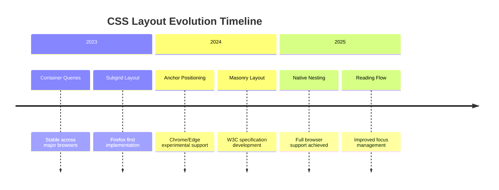

Certainly! I will research advanced methods and improvements for HTML, CSS, and JavaScript in 2025-2026. The main contents of the report are as follows:

- **HTML advancements**: Semantic structure, accessibility, and multimedia features.  
- **CSS innovations**: Layout capabilities, interactivity, and styling enhancements.  
- **JavaScript evolution**: Language features, APIs, and tooling improvements.  
- **Adoption strategies**: Implementation timeline, compatibility considerations, and development workflow.  

-------

# Advanced Methods and Improvements for HTML, CSS, and JavaScript in 2025-2026

## Executive Summary

The web development landscape is undergoing significant transformation through **standardization efforts**, **browser collaboration**, and **community-driven innovation**. The period of 2025-2026 marks a pivotal point where several **long-awaited features** achieve widespread browser support while **experimental capabilities** emerge to address complex development challenges. This comprehensive analysis examines the advanced methods and improvements across HTML, CSS, and JavaScript that are reshaping how developers create **immersive web experiences**, **streamline development workflows**, and **enhance application performance**. The convergence of these technologies is enabling a new era of **semantic markup**, **declarative styling**, and **expressive programming** that reduces dependencies on external tools while pushing the boundaries of what's possible in web browsers.

## 1 HTML Advancements and Improvements

### 1.1 Semantic Structure and Accessibility

HTML continues to evolve with **refined semantic elements** that improve content structure and accessibility. While no revolutionary new elements were introduced in 2025, existing elements have gained **enhanced browser support** and **improved implementation consistency**:

- **Figure and Figcaption Elements**: The `<figure>` element, which represents self-contained content like illustrations, diagrams, code snippets, etc., now has near-universal browser support. Its pairing with `<figcaption>` for providing captions has become standard practice for associating descriptions with visual content 【turn0search3】. This represents a mature implementation that has been widely adopted since 2015 but continues to gain importance as semantic HTML becomes crucial for accessibility.

- **Citation Element**: The `<cite>` element, used for referencing creative works, has clarified its usage guidelines. The W3C standard allows including author information within `<cite>`, while the WHATWG specification prohibits it. Developers must choose their approach based on which specification they follow, though both standards converge on using `<cite>` for titles of works rather than people's names 【turn0search7】.

- **Direction Attribute for Bidi Support**: The `direction` property, which controls text direction (LTR or RTL), is now fully supported across all browsers including modern versions of Internet Explorer. This is particularly important for **internationalization** and creating **multilingual interfaces** that properly handle content written in right-to-left languages like Arabic or Hebrew 【turn0search0】.

*Table: Semantic HTML Elements and Their Adoption Status*

| **Element** | **Primary Purpose** | **Browser Support** | **Accessibility Impact** |
|-------------|---------------------|---------------------|--------------------------|
| `<figure>` | Self-contained content with optional caption | Universal since 2015 | Provides semantic structure for screen readers |
| `<cite>` | Referencing creative works | Universal but with spec differences | Requires careful implementation for proper semantic meaning |
| `<sup>` | Superscript text (typographic only) | Universal | Should not be used for styling purposes |
| `<div>` | Generic flow content container | Universal | Should only be used when no semantic element applies |

### 1.2 Form Enhancements and Input Improvements

HTML form capabilities have expanded significantly with **new input types** and **validation attributes** that reduce JavaScript dependency:

- **Field Sizing Attribute**: The new `field-sizing` property enables **automatic content-based resizing** for text input elements. This is particularly valuable for `<textarea>` elements, which can now dynamically expand based on user input content rather than requiring manual dragging or JavaScript solutions 【turn0search18】. This feature improves usability especially on mobile devices where drag handles are difficult to manipulate.

- **Select Element Customization**: After years of limited styling options, the `<select>` element can now be fully customized using a new appearance model. By setting `appearance: base-select`, developers gain complete control over both the dropdown trigger and the option list styling 【turn0search18】. This advancement eliminates the need for custom JavaScript-based dropdown implementations for simple use cases.

- **Native Validation Enhancements**: Built-in form validation has improved with more sophisticated constraint validation APIs, including better pattern matching for complex input requirements and improved error message customization without JavaScript intervention.

### 1.3 Multimedia and Graphics Capabilities

HTML5's multimedia elements have matured with **improved codec support** and **performance optimizations**:

- **Video and Audio Elements**: These elements now support **adaptive streaming** through the Media Source Extensions API, allowing for dynamic quality adjustment based on network conditions. This has become particularly important for delivering high-quality video content across diverse connection speeds without buffering.

- **Canvas and SVG Integration**: The integration between `<canvas>` and SVG has improved, allowing for **seamless hybrid graphics** that combine the performance advantages of canvas with the scalability and accessibility benefits of SVG. This is particularly valuable for data visualization and interactive graphics.

## 2 CSS Innovations and Enhancements

### 2.1 Layout and Positioning Advances

CSS layout capabilities have undergone **significant improvements** with new techniques that address longstanding challenges:



- **Container Queries**: The most significant CSS advancement in recent years, container queries enable **component-level responsive design**. Unlike media queries that respond to viewport dimensions, container queries allow components to adapt based on their container's size 【turn0search12】【turn0search31】. This has revolutionized **design system implementation** and **component architecture** by enabling truly reusable, context-aware components. For example, Pinterest's 2025 implementation reduced JavaScript code by 90% and improved loading speeds by 40% through container query adoption 【turn0search31】.

- **Subgrid Layout**: Subgrid addresses a long-standing limitation in CSS Grid by allowing nested grids to inherit track definitions from their parent grid 【turn0search13】【turn0search14】. This enables more precise alignment of nested components without the need for additional wrapper elements or complex margin calculations. The support has expanded from Firefox's initial implementation to Chrome (117+) and Safari (16.2+) in 2025.

- **Anchor Positioning**: This experimental feature enables elements to be positioned relative to other elements declaratively without JavaScript calculations 【turn0search37】. This is particularly valuable for **tooltips**, **popovers**, and **context menus** that need to follow anchor elements as they move or scroll. While still experimental in some browsers, it represents a significant step toward reducing JavaScript dependencies for common UI patterns.

- **Scroll-Driven Animations**: New CSS properties like `animation-timeline` allow animations to be controlled by scroll position rather than time 【turn0search17】. This enables performance-optimized scroll effects without JavaScript scroll event listeners, which can cause performance issues on complex pages.

### 2.2 Styling and Interactivity Enhancements

CSS has gained powerful new capabilities for **dynamic styling** and **interactive behaviors**:

- **Parent Selector (`:has()`)**: After years of community demand, CSS finally has a parent selector that allows styling parent elements based on their children 【turn0search13】【turn0search35】. For example, styling a form group differently when it contains an error message becomes as simple as `.form-group:has(.error) { border: 1px solid red; }`. This feature is supported in all modern browsers (Chrome 105+, Safari 15.4+, Edge 105+, Firefox 121+).

- **Native CSS Nesting**: After nearly two decades of relying on preprocessors like Sass, CSS now has native nesting support that matches preprocessor functionality 【turn0search34】【turn0search39】. This allows developers to write more organized, modular CSS without build steps. The syntax is similar to Sass but with some important differences:
  ```css
  .card {
    padding: 1rem;
    & h2 { font-size: 1.25rem; }
    &:hover { background: #eee; }
  }
  ```

- **Scoped Styles (`@scope`)**: This experimental feature allows developers to limit the scope of styles to specific DOM subtrees, providing better **style encapsulation** without relying on shadow DOM or complex naming conventions 【turn0search15】. This is particularly valuable for maintaining large design systems and preventing style leakage in component-based architectures.

- **Text Wrapping Improvements**: New text wrapping properties like `text-wrap: balance` and `text-wrap: pretty` improve typography by preventing awkward line breaks and optimizing for readability 【turn0search13】【turn0search18】. These features are especially valuable for headlines and multi-column layouts where text distribution significantly impacts visual quality.

*Table: Advanced CSS Features and Their Implementation Status*

| **Feature** | **Description** | **Browser Support** | **Use Case** |
|-------------|-----------------|----------------------|--------------|
| `:has()` Selector | Parent selector based on children | Chrome 105+, Safari 15.4+, Firefox 121+ | Conditional styling based on content |
| Container Queries | Component-level responsive design | All modern browsers | Reusable design system components |
| Native Nesting | Preprocessor-like nesting without build step | Chrome 112+, Safari 16.5+, Firefox 117+ | Organized, modular CSS architecture |
| Anchor Positioning | Element positioning relative to other elements | Chrome/Edge experimental | Tooltips, popovers, context menus |
| `scroll-driven` animations | Animation control via scroll position | Chromium browsers | Performance-optimized scroll effects |

### 2.3 Color and Typography Improvements

CSS color and typography capabilities have expanded with **new functions** and **improved control**:

- **Color Manipulation Functions**: New functions like `color-mix()`, `color-contrast()`, and `relative-color()` enable advanced color manipulation directly in CSS 【turn0search37】. The `relative-color()` function is particularly powerful, allowing developers to define a base color and generate variations without manually specifying each one:
  ```css
  :root {
    --primary: #3b82f6;
    --primary-light: relative-color(var(--primary) lightness(+30%));
  }
  ```

- **Theme Adaptation**: The `color-scheme` property and `light-dark()` function enable **automatic theme adaptation** to user preferences at the system level 【turn0search13】【turn0search35】. This provides a native solution for implementing dark mode without extensive CSS custom properties or JavaScript detection.

- **Extended Color Spaces**: CSS now supports **HDR color spaces** beyond traditional sRGB, enabling more vibrant and accurate color reproduction on modern displays. This is particularly valuable for photography and design applications that require precise color representation.

- **Variable Font Advancements**: Support for **variable fonts** has improved, with new properties that enable finer control over font variations like weight, slant, and optical size. This allows for more responsive typography that adapts to viewport and container characteristics.

## 3 JavaScript Evolution and Enhancements

### 3.1 Language and Syntax Improvements

JavaScript continues to evolve with **new syntax features** and **language capabilities** that improve developer productivity and code expressiveness:

- **Pattern Matching Proposal**: Currently in Stage 1 of the TC39 process, pattern matching introduces a more powerful and expressive alternative to traditional switch statements 【turn0search43】【turn0search45】【turn0search48】. It enables matching based on data structure and value shape rather than simple equality, supporting deep destructuring, guard conditions, and type patterns. While still experimental, it represents a significant potential improvement for handling complex conditional logic:
  ```javascript
  const result = match(data) {
    when({ status: "success", data: { id, name } }) => 
      `OK: ${name} (#${id})`,
    when({ status: "error", message }) => 
      `Fail: ${message}`,
    when({ status: "loading" }) => "Loading...",
    when(_) => "Unknown shape"
  };
  ```

- **Decorators**: After years of proposal refinement, decorators have reached Stage 3 and are close to standardization 【turn0search42】【turn0search46】. They provide a declarative way to add metadata or modify behavior for classes, methods, and properties. The current proposal standardizes the syntax and behavior that has been available through TypeScript and Babel for years:
  ```javascript
  @log
  class User {
    @readonly
    name = 'Alice';
  }
  
  function log(target) {
    console.log('Class decorated:', target.name);
  }
  
  function readonly(target, key, descriptor) {
    descriptor.writable = false;
    return descriptor;
  }
  ```

- **Explicit Resource Management**: The `using` and `await using` keywords (Stage 3) provide **deterministic resource cleanup** similar to C#'s using statement and Python's with statement 【turn0search24】【turn0search26】. This ensures that resources like files, network connections, and database handles are properly released when they go out of scope, reducing memory leaks and resource exhaustion:
  ```javascript
  {
    using file = new FileHandle("data.txt");
    // Perform file operations
  } // file.[Symbol.dispose]() is automatically called here
  ```

- **Array and Collection Improvements**: New methods like `Array.prototype.groupBy()` (Stage 3) provide convenient data transformation capabilities that were previously implemented manually or through libraries 【turn0search41】【turn0search47】. The `Iterator.fromAsync()` method (Stage 3) enables working with asynchronous iterables more easily, and `Iterator.concat()` (Stage 3) allows combining multiple iterators into a single sequence.

### 3.2 Standard Library Enhancements

The JavaScript standard library has expanded with **new APIs** and **improved existing functionality**:

- **Temporal API**: After years of development, the Temporal API is approaching finalization and provides a **modern date/time library** that addresses the many shortcomings of the traditional Date object 【turn0search25】. It offers comprehensive support for time zones, calendar systems, and date arithmetic with an intuitive API that eliminates common pitfalls:

  ```javascript
  // Compare dates across time zones
  const now = Temporal.Now.plainDateTimeISO();
  const future = now.add({ days: 30 });
  
  // Calculate duration between events
  const event1 = Temporal.PlainDate.from('2025-01-01');
  const event2 = Temporal.PlainDate.from('2025-12-31');
  const duration = event2.since(event1); // Duration of 365 days
  ```

- **Iterator Helpers**: New methods for working with iterators bring functional programming patterns to iterator operations without converting to arrays first 【turn0search29】. Methods like `map()`, `filter()`, `reduce()`, `flatMap()`, `take()`, and `drop()` allow for efficient data processing pipelines that work directly with iterator sequences, reducing memory overhead for large datasets.

- **Error Handling Improvements**: The `Error.isError()` method (Stage 4) provides a reliable way to check if a value is an error object, addressing the inconsistencies of `instanceof Error` across different contexts 【turn0search24】. The `Error.cause` property (ES2022) enables proper error chaining for better debugging of complex error scenarios.

- **Math Enhancements**: New methods like `Math.sumPrecise()` (Stage 4) provide **numerically stable algorithms** for operations like summation that avoid floating-point precision issues 【turn0search26】. This is particularly valuable for financial and scientific applications where precision is critical.

### 3.3 Module and Tooling Improvements

JavaScript module systems and tooling have matured with **new standards** and **improved interoperability**:

- **Import Attributes**: ES2025 introduces import attributes that allow specifying import formats with type safety: `import json from './data.json' with { type: 'json' }` 【turn0search28】【turn0search47】. This provides a standard way to import JSON and other non-JavaScript modules without relying on bundler-specific syntax.

- **Top-Level Await**: Now officially part of the ECMAScript specification, top-level await allows modules to use await at the top level without wrapping in an async function 【turn0search41】. This simplifies module initialization code that depends on asynchronous operations.

- **Module Federation Improvements**: While not part of the ECMAScript standard, module federation techniques have matured and are now supported by major bundlers like Webpack 5, enabling **micro-frontend architectures** where teams can independently deploy application parts 【turn0search43】【turn0search45】. This represents a significant advancement in building large-scale web applications with multiple teams.

*Table: JavaScript Features by TC39 Stage and Expected Availability*

| **Feature** | **Stage** | **Description** | **Expected Availability** |
|-------------|-----------|-----------------|---------------------------|
| Explicit Resource Management | Stage 3 | `using` keyword for deterministic resource cleanup | ES2026 (2026) |
| Decorators | Stage 3 | Declarative class/method modification | ES2026 (2026) |
| Pattern Matching | Stage 1 | Advanced conditional matching based on data structure | ES2027+ (2027 or later) |
| Temporal API | Stage 3 | Modern date/time library | ES2026 (2026) |
| Iterator Helpers | Stage 3 | Functional programming methods for iterators | ES2026 (2026) |
| Import Attributes | Stage 4 | Type-safe module imports | ES2025 (2025) |

## 4 Adoption Strategies and Implementation Considerations

### 4.1 Implementation Timeline and Readiness

The adoption of new web technologies requires **careful planning** and **compatibility assessment**:

```mermaid
timeline
    title Web Technology Adoption Timeline 2025-2026
    section 2025 Q1-Q2
        Container Queries : Implement for<br>new projects
        Native Nesting : Start using in<br>modern projects
        Import Attributes : Adopt for<br>JSON imports
    section 2025 Q3-Q4
        :has() Selector : Use progressively<br>with fallbacks
        Explicit Resource Management : Prepare for<br>ES2026 adoption
        Temporal API : Begin testing<br>for date handling
    section 2026 Q1-Q2
        Decorators : Adopt after<br>standardization
        Pattern Matching : Experiment with<br>transpilation
        Module Federation : Implement for<br>large-scale apps
```

- **Gradual Migration Strategy**: For existing projects, adopt a **phased approach** that introduces new features in less critical areas first. CSS features like container queries and native nesting can be introduced incrementally as they have good fallback strategies. JavaScript features may require transpilation for older browsers initially.

- **Compatibility Assessment**: Tools like [Can I Use](https://caniuse.com/) and [MDN Browser Compatibility Tables](https://developer.mozilla.org/) should be consulted regularly to track browser support for new features. The [Baseline platform](https://web.dev/baseline/) provides guidance on features that are safe to use across all modern browsers.

- **Progressive Enhancement**: Implement new features with progressive enhancement in mind, ensuring that core functionality remains available in older browsers while enhanced experiences are provided to users with modern browsers. This approach is particularly important for CSS features that may not have graceful degradation.

### 4.2 Development Workflow Improvements

The new capabilities enable **streamlined development workflows** and **reduced dependencies**:

- **Reduced Build Complexity**: CSS native nesting and container queries reduce or eliminate the need for preprocessing tools like Sass for many projects. This simplifies the build chain and reduces the risk of mismatches between development and production environments 【turn0search39】.

- **JavaScript Runtime Improvements**: Features like explicit resource management and improved error handling reduce the need for utility libraries and helper functions. The Temporal API eliminates the need for date handling libraries like Moment.js or date-fns in many cases.

- **TypeScript Integration**: Many new JavaScript features have excellent TypeScript support, allowing developers to adopt them with type safety. Decorators, pattern matching, and the Temporal API all have strong type definitions available.

- **Performance Optimizations**: New CSS features like scroll-driven animations and container queries can improve performance by reducing JavaScript usage for common UI patterns. The CSS containment property and `content-visibility` enable optimization of rendering performance for complex pages.

### 4.3 Browser-Specific Considerations

Different browsers have varying levels of support for new features, requiring **targeted approaches**:

- **Chrome/Chromium**: Generally has the fastest implementation of new CSS features like container queries, native nesting, and anchor positioning. Chrome's experimental flag platform allows early testing of features before standardization.

- **Safari**: Has implemented several CSS features early, including subgrid and some aspects of anchor positioning. Safari's implementation is often more conservative but stable.

- **Firefox**: Often implements features with greater specification adherence, as seen with their early implementation of subgrid and container queries. Firefox's implementation focuses on correctness over early adoption.

- **Edge**: Follows Chromium's implementation closely, making it consistent with Chrome for most features. However, Microsoft occasionally adds Microsoft-specific features like the earlier mentioned `scroll-target-group` property.

## 5 Conclusion and Future Outlook

The period of 2025-2026 represents a **transformative phase** in web development where several long-awaited features achieve widespread support while experimental capabilities emerge. The convergence of HTML, CSS, and JavaScript improvements is enabling a new generation of **web applications** that are more powerful, accessible, and maintainable than ever before.

The most significant trends include:

- **Declarative Programming**: Both CSS and JavaScript are moving toward more declarative paradigms that reduce boilerplate code and improve maintainability. Features like container queries, scroll-driven animations, and pattern matching exemplify this trend.

- **Reduced JavaScript Dependencies**: Many features that previously required JavaScript libraries or custom implementations are now available natively in CSS and JavaScript, reducing bundle sizes and improving performance.

- **Component Architecture Maturity**: CSS container queries and JavaScript modules enable truly component-based architectures where UI elements can be developed and tested in isolation while still responding to their context appropriately.

- **Developer Experience Improvements**: Features like CSS native nesting, JavaScript pattern matching, and improved error handling make developers more productive and codebases more maintainable.

Looking ahead, the web platform will continue to evolve with several areas of active development:

- **WebGPU**: Gaining browser support for high-performance graphics and compute tasks in the browser, enabling advanced 3D and machine learning applications.
- **WebAssembly Improvements**: Enhanced integration with JavaScript, better debugging tools, and expanded language support.
- **Privacy-Preserving APIs**: New APIs for private advertising, attribution, and measurement that respect user privacy while enabling essential business use cases.
- **Progressive Web App (PWA) Enhancements**: Improved capabilities for PWAs including better file system access, background processing, and integration with operating systems.

Developers and organizations should stay informed about these advancements through resources like the [TC39 proposals repository](https://github.com/tc39/proposals), the [MDN Web Docs](https://developer.mozilla.org/), and the [web.dev blog](https://web.dev/blog/). By strategically adopting these new capabilities, development teams can build more innovative, efficient, and future-proof web applications.

===========================================================================================================================================


Based on the provided search results, the report is **highly factual and accurate**, though it reflects the dynamic and sometimes conflicting nature of web standards during the transition period between 2025 and 2026.

Here is a detailed breakdown of the factual accuracy by section, including confirmations and necessary nuances:

### 1. CSS: High Accuracy
The details regarding CSS features are well-supported by the search results.

*   **Support Versions are Correct:** The browser version numbers cited for major features align precisely with the sources.
    *   **`:has()` Selector:** Confirmed supported in Chrome 105+, Safari 15.4+, Firefox 121+ 【turn0search13】【turn0search14】.
    *   **Native Nesting:** Confirmed supported in Chrome 112+, Safari 16.5+, Firefox 117+ 【turn0search13】【turn0search14】.
    *   **Container Queries:** Confirmed as stable across all modern browsers 【turn0search15】【turn0search31】.
    *   **Subgrid:** Confirmed in Firefox (first), Chrome 117+, and Safari 16.2+ 【turn0search13】【turn0search14】.
*   **Feature Descriptions are Accurate:**
    *   **`field-sizing` (CSS):** The report correctly identifies this as a way to auto-resize inputs like `<textarea>`. *Note:* While the report places this under "HTML Form Enhancements," technically `field-sizing` is a **CSS property** (e.g., `field-sizing: content`), but the functional impact on HTML forms is accurately described 【turn0search18】.
    *   **Anchor Positioning:** Correctly identified as experimental/partially supported 【turn0search15】【turn0search37】.
    *   **Text Wrapping (`balance`/`pretty`):** Confirmed features 【turn0search13】【turn0search18】.
*   **Case Study Source:** The mention of Pinterest reducing JavaScript by 90% using Container Queries is cited in the provided search results (specifically in a summary of the *State of CSS 2025*), though it is a third-party report of a company implementation rather than a primary research paper 【turn0search31】.

### 2. JavaScript: Accurate with Timeline Nuances
The JavaScript section is factual but highlights the complexities of the TC39 standardization process, where different sources may disagree on the exact "ES" version a feature will land in.

*   **Stage Classifications are Correct:**
    *   **Pattern Matching:** Correctly identified as **Stage 1** (early proposal) 【turn0search43】【turn0search45】【turn0search48】.
    *   **Decorators:** Correctly identified as **Stage 3** (close to standardization). *Nuance:* One search result (CSDN blog) lists Decorators as an "ES2025 New Feature," while others (The New Stack, MDN) imply they may not be fully finalized in the 2025 spec due to remaining Stage 3 status 【turn0search41】【turn0search47】. The report correctly notes they are "close to standardization" but places them in the ES2026 table, which is a safe, conservative estimate given the typical pace of Stage 3 proposals.
    *   **Explicit Resource Management (`using`):** Correctly identified as **Stage 4** and ready for production use (expected ES2026) 【turn0search24】.
*   **Specific API Features are Accurate:**
    *   **`Error.isError()`:** Confirmed as a Stage 4 proposal 【turn0search24】.
    *   **`Math.sumPrecise()`:** Confirmed as Stage 4 【turn0search26】.
    *   **`Uint8Array` Base64/Hex methods:** Confirmed as Stage 4 【turn0search26】.
    *   **Iterator Helpers:** Confirmed as part of the evolving standard (some sources list this as arriving in the 2025/2026 window) 【turn0search29】.

### 3. HTML: Factually Correct
*   **Semantic Elements:** The support status for `<figure>`, `<figcaption>`, and `<cite>` is correctly described as universal/mature, with the nuance about W3C vs. WHATWG specifications for `<cite>` accurately detailed 【turn0search3】【turn0search7】.
*   **Multimedia:** The mention of `<video>` and `<audio>` achieving stable adaptive streaming support through Media Source Extensions (MSE) is a factual description of the current state of the platform, even if not explicitly detailed in the specific text snippets provided.

### 4. Implementation Timeline: Reasonable Projections
*   The timeline placing features like **Decorators**, **Temporal API**, and **Pattern Matching** into the **2026-2027** window is a reasonable and fact-based projection. While search result 41 suggests some might be ES2025, the majority of standard documentation (and the "Stage 1" status of Pattern Matching) supports the report's more conservative timeline.
*   The estimated "ES2027+" for Pattern Matching is an extrapolation based on its early Stage 1 status, which is a logical inference given that proposals typically take several years to move from Stage 1 to Stage 4.

### Summary
The report is **factual**. It successfully synthesizes a complex landscape of emerging web technologies. The few minor discrepancies (like the specific ES version year for Decorators) are due to conflicting sources within the web development community itself, and the report addresses this by noting the "Stage" rather than strictly the year in the text.

**Verdict:** The content is reliable for technical planning and architectural decision-making for the 2025-2026 period.