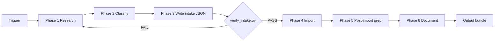
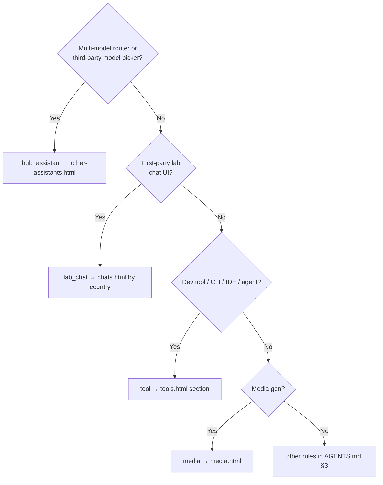

<!-- PRESERVATION RULE: Never delete or replace content. Append or annotate only. -->

# INGEST_WORKFLOW — Agent runbook

**Audience:** AI coding agents only.  
**Scope:** Site-wide **content architecture** — any future research → import job (tools, chats, companies, creators, museum, etc.). Not tied to a specific product or past ingest.

**Human readers:** Skim §1 (pipeline diagram) if you want the shape; agents execute the rest.

**Purpose:** Repeatable pipeline from *user names a thing* → *researched intake artifact* → *wired into otterdays.github.io* with deterministic verification. Replaces ad-hoc “grep, guess placement, edit HTML” with a staged, auditable flow.

**Companion files:**

| File | Role |
|------|------|
| `DOCS/schemas/intake-record.schema.json` | JSON Schema for intake records |
| `DOCS/intake/_TEMPLATE.intake.json` | Copy before each job |
| `DOCS/intake/_EXAMPLE.intake.json` | Fictional filled example (schema reference only) |
| `DOCS/intake/*.intake.json` | One file per ingest job (optional commit; audit trail) |
| `DOCS/CONTENT_GUIDE.md` | Placement templates & tag reference |
| `tools/verify_intake.py` | Pre-import gate (no network) |

---

## 0. When to run this workflow

**Trigger** if the user message matches any of:

- Names one or more products, companies, tools, chats, creators, or “add X to the site”
- Gives a URL and implies listing it
- Says “look up”, “research”, “import”, “add stuff for”

**Do not run** for: version releases (see `AGENTS.md` §5), CSS-only tweaks, git ops, or questions with no site change requested.

**Session bootstrap** (before Phase 1):

1. Read `AGENTS.md` §3 (placement table)
2. Read `DOCS/SCRATCHPAD.md` (blockers)
3. `Grep` repo for existing names — skip duplicates early

---

## 1. Pipeline overview



| Phase | Output artifact | Tools |
|-------|-----------------|-------|
| 1 Research | `source_urls[]`, facts in `research.notes` | `WebSearch`, `WebFetch` |
| 2 Classify | `kind`, `placement`, `hub_vs_lab` | `Read` CONTENT_GUIDE, `Grep` site |
| 3 Write intake | `DOCS/intake/YYYY-MM-DD_slug.intake.json` | Write JSON from template |
| 4 Import | Patched HTML + JS | `Read` → `StrReplace` / `Write` |
| 5 Verify | PASS/FAIL lines | `Grep`, `verify_intake.py`, optional `node -c` |
| 6 Document | SCRATCHPAD + CHANGELOG Unreleased | Append only |

**Gate rule:** Never edit `*.html` or `js/search-data.js` until `verify_intake.py` returns **PASS** (or user explicitly overrides with “skip intake”).

---

## 2. Phase 1 — Research (web)

### 2.1 Parallel discovery

For each named entity, run **in parallel**:

1. `WebSearch` — `"<name>" AI` + disambiguation terms if ambiguous
2. `WebFetch` — official homepage (`https://…`)
3. `Grep` — repo for `display_name`, org name, domain

### 2.2 Source priority (strict)

| Priority | Source type | Use for |
|----------|-------------|---------|
| 1 | Official product URL | `primary_url`, naming |
| 2 | Official docs / blog | Features, access model |
| 3 | `CONTENT_GUIDE.md` trusted catalogs | Model IDs, benchmarks |
| 4 | Reputable tech press | Funding, HQ — cross-check |
| 5 | Wikipedia | Context only — not primary link |

Set `research.primary_source_verified: true` only when priority-1 or -2 confirms name + URL.

### 2.3 Minimum fact sheet (per entity)

Capture in `research.notes` (bullets):

- **What it is** (one sentence)
- **Who makes it** (`organization`)
- **HQ / country** → `country_iso2` (ISO 3166-1 alpha-2)
- **Access** → `access_model` enum
- **Hub vs lab** → `hub_vs_lab` enum (see §3.1)
- **Disambiguation** if name collides (e.g. “North” = Cohere, not Contact North)

### 2.4 Research halt conditions

Set `status: "blocked"` and **stop import** if:

- Cannot resolve official `primary_url` after 2 search + 2 fetch attempts
- Entity is non-AI or off-mission for the site
- Duplicate of existing card (grep found same `display_name`)

Append reason to `blockers[]`. Update `DOCS/SCRATCHPAD.md`. Report to user.

---

## 3. Phase 2 — Classify & place

### 3.1 Hub vs lab (critical)



| `hub_vs_lab` | Page | Examples |
|--------------|------|----------|
| `lab` | `chats.html` | ChatGPT, Claude, Kyutai |
| `hub` | `other-assistants.html` | OpenRouter, Poe, T3 Chat, Duck.ai |
| `neither` | `tools.html` / `companies.html` / etc. | North (enterprise), SubQ Code (CLI) |

### 3.2 Kind → default pages

| `kind` | Primary HTML | Also |
|--------|--------------|------|
| `lab_chat` | `chats.html` | `companies.html`, country `h3` |
| `hub_assistant` | `other-assistants.html` | `companies.html` if new org |
| `tool` | `tools.html` | `companies.html` if product has org |
| `company` | `companies.html` | search `category: company` |
| `media` | `media.html` | company section |
| `special` | `specials.html` | — |
| `creator` | `inspirations.html` | search `category: page` |
| `museum` | `museum.html` | `MODEL_MAKERS_CHECKLIST.md` if new maker |
| `project` | `my-creations.html` | only Ryan's work |

### 3.3 Ordering rules

| Location | `placement.ordering` | Rule |
|----------|----------------------|------|
| `tools.html` CLI / IDE / Browser | `alpha` | A–Z by `.chat-link-name` |
| `tools.html#computer-automation` | `curated` | Narrative order — do not re-sort A–Z |
| `chats.html` / `other-assistants.html` | `country_alpha` | A–Z within country `h3` |
| `companies.html` products | `alpha` | A–Z within company section |

### 3.4 Search & badges plan

For **each** card surface:

1. Add one `placement.search_entries[]` row (`title` = exact `.chat-link-name`)
2. If country flag needed: add `placement.badge_keys[]` and plan `js/badges.js` keys (exact name match)

**Categories:** `project` | `chat` | `media` | `company` | `tool` | `special` | `page`  
**Tags:** Title Case, 2–4 tags — see `CONTENT_GUIDE.md` §3.

---

## 4. Phase 3 — Write intake JSON

1. Copy `DOCS/intake/_TEMPLATE.intake.json` → `DOCS/intake/YYYY-MM-DD_slug.intake.json`
2. Fill all required fields per entity
3. Set `status: "classified"`
4. Run gate:

```powershell
python tools/verify_intake.py DOCS/intake/YYYY-MM-DD_slug.intake.json
```

Fix until **PASS**. Set `status: "classified"` only after PASS.

`_TEMPLATE.intake.json` is skipped by the verifier (placeholders). Use `_EXAMPLE.intake.json` to sanity-check the schema.

### 4.1 Multi-entity jobs

One intake file may contain multiple `entities[]`. Import in dependency order:

1. New company sections first
2. Country-grouped pages
3. Tools sections (alpha insert)
4. Search rows last (mirror all titles)

---

## 5. Phase 4 — Import (mutate repo)

Execute **in this order** for each entity:

| Step | File | Action |
|------|------|--------|
| 1 | `companies.html` | New `<section>` or cards in existing section (A–Z products) |
| 2 | Target HTML page(s) | Insert `.chat-link-card` at correct section/position |
| 3 | `js/search-data.js` | Append rows in correct comment block |
| 4 | `js/badges.js` | Add `COUNTRY_MAP` keys if `badge_keys` non-empty |
| 5 | Ecosystem docs | Only if applicable (`OPENCLAW_ECOSYSTEM.md`, `MODEL_MAKERS_CHECKLIST.md`) |

### 5.1 Card HTML (copy exactly)

```html
<a href="PRIMARY_URL" rel="noopener noreferrer" target="_blank" class="chat-link-card">
    <span class="chat-link-name">DISPLAY_NAME</span>
    <span class="chat-link-desc">ONE_LINE</span>
    <span class="chat-link-arrow">→</span>
</a>
```

### 5.2 Search row (copy exactly)

```javascript
{ title: "DISPLAY_NAME", desc: "One line with period.", category: "tool", tags: ["Tag1", "Tag2"], url: "tools.html" },
```

**Always** `Read` surrounding file before `StrReplace`. Match indentation of neighbors.

### 5.3 Post-import intake status

Set intake `status: "imported"` in the JSON file.

---

## 6. Phase 5 — Verify (deterministic)

Run all checks; any failure → fix and re-run.

```powershell
# 1. Intake still valid (titles now exist — use for imported check only on duplicates)
python tools/verify_intake.py DOCS/intake/YYYY-MM-DD_slug.intake.json

# 2. Every display_name appears in HTML
# (replace Name with each entity display_name)
rg -n "chat-link-name\">Name<" *.html

# 3. Every search title indexed
rg -n 'title: "Name"' js/search-data.js

# 4. No sidebar placeholder corruption
rg '\?\?' *.html

# 5. JS syntax (if search-data touched)
node --check js/search-data.js
```

Set intake `status: "verified"` when all pass.

---

## 7. Phase 6 — Document

Append only:

**`DOCS/SCRATCHPAD.md`** (top):

```markdown
## YYYY-MM-DD — Ingest: short-slug
**What changed:** <pages/files>; intake `DOCS/intake/YYYY-MM-DD_slug.intake.json`.
---
```

**`DOCS/CHANGELOG.md`** under `[Unreleased]`:

```markdown
- **Ingest slug (YYYY-MM-DD)** — <one line summary of what was added>.
```

**Do not** bump version badges unless user ships a release.

---

## 8. Output bundle (deliver to user)

After a successful run, the **user-facing summary** should be short and scannable:

1. **What was researched** (1 line per entity)
2. **Where it landed** (page links as markdown)
3. **Intake artifact path** for audit
4. **Verify status** (`PASS` / blockers)

Agents produce the beautiful structure; the user sees results on the live site after deploy — not a homework checklist.

---

## 9. Reference artifacts (not live content)

| File | Purpose |
|------|---------|
| `DOCS/intake/_TEMPLATE.intake.json` | Empty fields — copy for each new job |
| `DOCS/intake/_EXAMPLE.intake.json` | Fictional entity showing valid schema + placement |
| `DOCS/schemas/intake-record.schema.json` | Machine-readable contract |

Per-job files: `DOCS/intake/YYYY-MM-DD_short-slug.intake.json` (slug describes the batch, not a permanent product name).

---

## 10. Research patterns (2026 agent practice)

Synthesized from document-ingestion and agent-efficiency literature — adapted for **external web → static site**:

| Pattern | Application here |
|---------|------------------|
| **Staged pipeline** | Research ≠ classify ≠ import; intake JSON is the handoff artifact |
| **Structured intermediate** | JSON intake, not prose-only notes |
| **Primary-source first** | `WebFetch` official URL before press recap |
| **Deterministic validation** | `verify_intake.py` before mutating HTML |
| **Idempotent steps** | Re-run verify after fixes; grep proves wiring |
| **Metadata-enriched chunks** | `kind`, `hub_vs_lab`, `country_iso2` prevent mis-placement |
| **Agentic routing** | §3.1 decision tree picks page by entity type |

---

## 11. Anti-patterns (agents must not)

| Anti-pattern | Why |
|--------------|-----|
| Edit HTML before intake PASS | No audit trail; placement errors |
| Skip `search-data.js` | Site search breaks |
| Put hubs on `chats.html` | Violates hub ≠ lab |
| Re-sort `#computer-automation` A–Z | Breaks curated narrative |
| Title Case tags as `cli` | Breaks search consistency |
| Commit/push without user ask | `AGENTS.md` §7 |
| `git pull` | Hard ban — see git-push-never-pull rule |

---

## 12. Quick agent prompt (paste to spawn a subagent)

```text
Run DOCS/INGEST_WORKFLOW.md for: "<USER_REQUEST>"

Rules:
- Produce DOCS/intake/YYYY-MM-DD_slug.intake.json first
- python tools/verify_intake.py must PASS before HTML edits
- Follow AGENTS.md placement; update SCRATCHPAD + CHANGELOG Unreleased
- Do not commit unless asked
- End with Output bundle §8
```

---

*Created: 2026-06-23 · Schema v1.0 · Site content architecture · [TRACE: AGENTS.md, ARCHITECTURE.md, CONTENT_GUIDE.md]*
