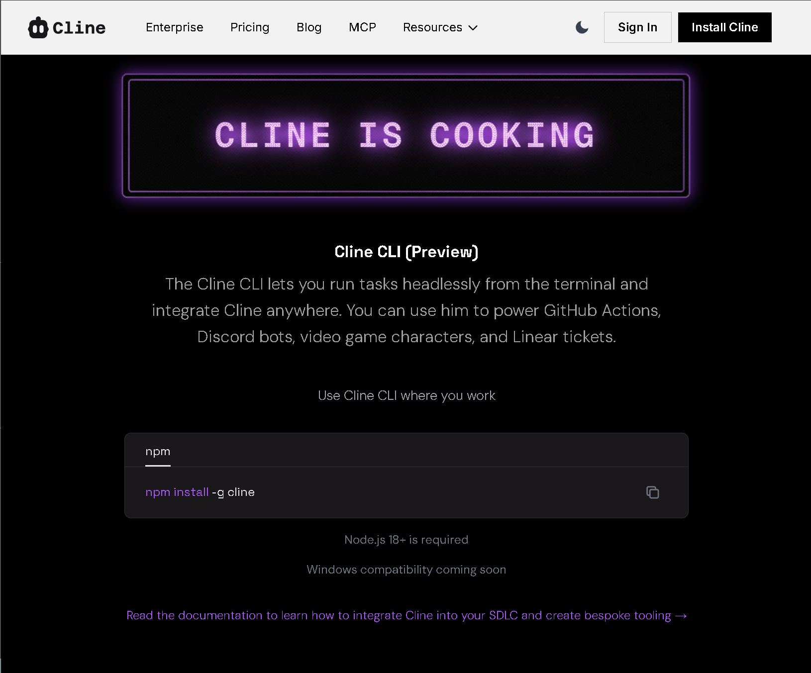

# 🩹 Patch 1 — Performance & Optimization

**Date:** 2026-02-16
**Target:** otterdays.github.io
**Status:** 🔲 Not Started
**Version:** Applies to v1.8.1

---

## Overview

This patch addresses **7 performance issues** causing perceived lag across the site,
especially on heavy pages like `tools.html` (100+ cards) and `companies.html` (78+ sections).

**Expected outcome:** Noticeably smoother interactions, faster initial paint, reduced GPU load.

---

## Task Checklist

- [ ] **P1** — Remove wildcard `*` transition
- [ ] **P2** — Throttle & merge mousemove listeners
- [ ] **P3** — Move Google Fonts to `<link>` (all HTML pages)
- [ ] **P4** — Add `defer` to search scripts (all HTML pages)
- [ ] **P5** — Compress `cline-cli.png` → WebP
- [ ] **P6** — Add `will-change` to mesh background
- [ ] **P7** — Reduce `backdrop-filter` overuse

---

## P1 — Remove Wildcard `*` Transition

**Priority:** 🔴 Critical
**Impact:** 🔴🔴🔴 — Largest single cause of lag
**Effort:** ⚡ 30 seconds
**File:** `css/style.css`

### Problem

Lines 50–55 apply transitions to **every element** on the page:

```css
/* ❌ CURRENT — css/style.css lines 50-55 */
*,
*::before,
*::after {
  transition: background-color 0.3s ease, border-color 0.3s ease, color 0.2s ease, transform 0.2s ease, box-shadow 0.25s ease;
}
```

On pages with 200+ DOM elements (tools, companies), the browser tracks transition state
for **thousands of elements** simultaneously. Every theme change, hover, or scroll
triggers mass recalculations.

### Fix

**Delete lines 50–55 entirely.** The individual selectors already define their own transitions:
- `.sidebar a` → `transition: all 0.2s ease` (line 113)
- `.project-card` → `transition: all 0.3s cubic-bezier(...)` (line 821)
- `.chat-link-card` → `transition: all 0.3s cubic-bezier(...)` (line 972)
- `.home-link` → `transition: all 0.25s cubic-bezier(...)` (line 711)
- `.theme-btn` → `transition: all 0.25s cubic-bezier(...)` (line 523)

```css
/* ✅ AFTER — css/style.css lines 50-55 */
/* (deleted — transitions are defined on individual selectors) */
```

### Verification

1. Open any page → hover cards, switch themes, scroll
2. All animations should still work identically (they inherit from their own selectors)
3. Open DevTools → Performance tab → record a scroll → "Recalculate Style" events should drop significantly

---

## P2 — Throttle & Merge Mousemove Listeners

**Priority:** 🔴 Critical
**Impact:** 🔴🔴🔴 — Fires 60×/sec on every card
**Effort:** 🔧 15 minutes
**File:** `js/theme.js`

### Problem

Two separate mousemove systems run on the same cards:

**System 1 — Spotlight (lines 157–168):**
A **document-level** listener that iterates over ALL cards on every pixel of mouse movement.

```js
/* ❌ CURRENT — js/theme.js lines 157-168 */
var cards = document.querySelectorAll('.project-card, .chat-link-card, .home-link');

document.addEventListener('mousemove', function (e) {
    cards.forEach(function (card) {
        var rect = card.getBoundingClientRect();
        var x = e.clientX - rect.left;
        var y = e.clientY - rect.top;
        card.style.setProperty('--mouse-x', x + 'px');
        card.style.setProperty('--mouse-y', y + 'px');
    });
});
```

**System 2 — 3D Tilt (lines 208–230):**
Individual mousemove listeners on every card (duplicates the same selector query).

```js
/* ❌ CURRENT — js/theme.js lines 208-230 */
var tiltCards = document.querySelectorAll('.project-card, .chat-link-card, .home-link');

tiltCards.forEach(function (card) {
    card.addEventListener('mousemove', function (e) {
        var rect = card.getBoundingClientRect();
        // ... 3D tilt math ...
        card.style.transform = 'perspective(1000px) rotateX(...)';
    });

    card.addEventListener('mouseleave', function () {
        card.style.transform = 'perspective(1000px) rotateX(0) rotateY(0) scale(1)';
    });
});
```

On `tools.html` with 100+ cards, this means:
- 1 document-level listener iterating 100+ cards per mouse event
- 100+ individual card listeners
- All firing at 60fps = **~12,000 function calls per second**

### Fix

Replace **both** systems with a single, throttled, delegated handler:

```js
/* ✅ AFTER — js/theme.js — replace lines 153-230 with: */

/**
 * Unified Card Effects (Spotlight + 3D Tilt)
 * Uses requestAnimationFrame throttle + event delegation.
 */
(function () {
    var CARD_SELECTOR = '.project-card, .chat-link-card, .home-link';
    var ticking = false;

    // Spotlight: document-level, throttled via rAF
    document.addEventListener('mousemove', function (e) {
        if (ticking) return;
        ticking = true;

        requestAnimationFrame(function () {
            // Only update cards near the cursor (within 600px radius)
            var cards = document.querySelectorAll(CARD_SELECTOR);
            var cx = e.clientX;
            var cy = e.clientY;

            cards.forEach(function (card) {
                var rect = card.getBoundingClientRect();

                // Skip cards far from cursor (off-screen or distant)
                if (
                    rect.bottom < cy - 600 || rect.top > cy + 600 ||
                    rect.right < cx - 600 || rect.left > cx + 600
                ) return;

                var x = cx - rect.left;
                var y = cy - rect.top;
                card.style.setProperty('--mouse-x', x + 'px');
                card.style.setProperty('--mouse-y', y + 'px');
            });

            ticking = false;
        });
    });

    // 3D Tilt: delegated to document, only acts on hovered card
    document.addEventListener('mousemove', function (e) {
        var card = e.target.closest(CARD_SELECTOR);
        if (!card) return;

        var rect = card.getBoundingClientRect();
        var xPct = (e.clientX - rect.left) / rect.width;
        var yPct = (e.clientY - rect.top) / rect.height;
        var xRot = (0.5 - yPct) * 10;
        var yRot = (xPct - 0.5) * 10;

        card.style.transform = 'perspective(1000px) rotateX(' + xRot + 'deg) rotateY(' + yRot + 'deg) scale(1.02)';
    });

    document.addEventListener('mouseleave', function (e) {
        var card = e.target.closest(CARD_SELECTOR);
        if (card) {
            card.style.transform = 'perspective(1000px) rotateX(0) rotateY(0) scale(1)';
        }
    }, true); // useCapture to catch mouseleave on children
})();
```

### Key changes

| Before | After |
|--------|-------|
| 100+ individual card listeners | 2 delegated document listeners |
| Fires on every pixel (60fps) | Spotlight throttled via `requestAnimationFrame` |
| Iterates ALL cards on spotlight | Skips cards farther than 600px from cursor |
| Two querySelectorAll calls | One selector string, delegated via `closest()` |

### Verification

1. Hover over cards → should still see spotlight glow + 3D tilt
2. Open DevTools → Performance → record mouse movement → Event handler time should be < 2ms/frame
3. Cards off-screen should NOT be updated

---

## P3 — Move Google Fonts to `<link>`

**Priority:** 🟠 Medium
**Impact:** 🟠🟠 — Faster first paint
**Effort:** ⚡ 5 minutes
**Files:** `css/style.css` + **ALL 10 HTML pages**

### Problem

Line 4 in `style.css`:

```css
/* ❌ CURRENT — css/style.css line 4 */
@import url('https://fonts.googleapis.com/css2?family=Inter:wght@400;500;600;700&family=Space+Grotesk:wght@500;600;700&display=swap');
```

CSS `@import` is **double render-blocking**: browser downloads `style.css`, discovers
the import, then makes a second network request. This creates a waterfall.

### Fix

**Step 1:** Delete line 4 from `css/style.css`:

```css
/* ✅ AFTER — css/style.css line 4 */
/* (deleted — fonts loaded via <link> in HTML) */
```

**Step 2:** Add these 3 lines to the `<head>` of ALL HTML pages, **before** the stylesheet link:

```html
<!-- ✅ ADD to <head> BEFORE <link rel="stylesheet" href="css/style.css"> -->
<link rel="preconnect" href="https://fonts.googleapis.com">
<link rel="preconnect" href="https://fonts.gstatic.com" crossorigin>
<link rel="stylesheet" href="https://fonts.googleapis.com/css2?family=Inter:wght@400;500;600;700&family=Space+Grotesk:wght@500;600;700&display=swap">
```

**Pages to update (10):**
- [ ] `index.html`
- [ ] `programs.html`
- [ ] `chats.html`
- [ ] `media.html`
- [ ] `companies.html`
- [ ] `tools.html`
- [ ] `specials.html`
- [ ] `skills.html`
- [ ] `about.html`
- [ ] `404.html`

### Verification

1. Open any page → fonts should still load correctly
2. DevTools → Network → the font request should start **in parallel** with `style.css`, not after it

---

## P4 — Add `defer` to Search Scripts

**Priority:** 🟠 Medium
**Impact:** 🟠 — Faster interactive time
**Effort:** ⚡ 30 seconds per page
**Files:** ALL 10 HTML pages

### Problem

`search-data.js` (49KB) and `search.js` (17KB) are loaded synchronously at the bottom
of every page. While they're near `</body>`, adding `defer` lets the browser
start downloading them during HTML parse instead of waiting.

### Fix

In every HTML page, change the script tags:

```html
<!-- ❌ CURRENT -->
<script src="js/theme.js"></script>
<script src="js/search-data.js"></script>
<script src="js/search.js"></script>

<!-- ✅ AFTER -->
<script src="js/theme.js"></script>
<script src="js/search-data.js" defer></script>
<script src="js/search.js" defer></script>
```

> **Note:** `theme.js` stays synchronous because it sets `data-theme` on `body`
> and needs to run before paint to avoid a flash of unstyled theme.

> **Note:** `search.js` depends on `SEARCH_DATA` from `search-data.js`.
> With `defer`, both scripts maintain their order — `search-data.js` will
> always execute before `search.js`.

**Pages to update (10):** Same list as P3.

Additional pages that also load `badges.js` or `companies.js`:
- `programs.html` — also has `<script src="js/badges.js"></script>` → add `defer`
- `companies.html` — also has `<script src="js/badges.js"></script>` and `<script src="js/companies.js"></script>` → add `defer`
- Other pages with `badges.js` → add `defer`

### Verification

1. Open any page → search (`Ctrl+K`) should still work
2. Badge injection on `programs.html` should still work
3. Company collapsible sections should still work

---

## P5 — Compress `cline-cli.png` → WebP

**Priority:** 🟠 Medium
**Impact:** 🟠 — ~400KB saved
**Effort:** ⚡ 2 minutes
**Files:** `images/cline-cli.png` + `tools.html`

### Problem

`images/cline-cli.png` is **434KB** — massive for a card thumbnail image at 120×80px.
This alone adds 1–2 seconds of load time on slower connections.

### Fix

**Step 1:** Convert the image to WebP (aim for ~30-50KB):

```powershell
# Option A: Use an online converter (squoosh.app, cloudconvert.com)
# Option B: Use ffmpeg if installed:
ffmpeg -i images/cline-cli.png -quality 80 images/cline-cli.webp
```

**Step 2:** Update `tools.html` to use WebP with PNG fallback:

```html
<!-- ❌ CURRENT — tools.html line 126 -->
<span class="chat-link-card-image"></span>

<!-- ✅ AFTER -->
<span class="chat-link-card-image">
  <picture>
    <source srcset="images/cline-cli.webp" type="image/webp">
    
  </picture>
</span>
```

> **Note:** Also added `loading="lazy"` since this image is likely below the fold.

### Verification

1. Open `tools.html` → Cline CLI card should still show the image
2. DevTools → Network → image should be ~30-50KB instead of 434KB

---

## P6 — Add `will-change` to Mesh Background

**Priority:** 🟡 Low
**Impact:** 🟡 — Reduced GPU compositing cost
**Effort:** ⚡ 30 seconds
**File:** `css/style.css`

### Problem

The animated mesh gradient on `body::before` uses `filter: blur(60px)` with a continuous
15-second animation. Without `will-change`, the browser may not promote this to its own
compositor layer, causing repaints of the entire page.

### Fix

```css
/* ❌ CURRENT — css/style.css lines 348-354 */
body::before {
  background: radial-gradient(circle at 15% 50%, var(--accent-glow) 0%, transparent 45%),
    radial-gradient(circle at 85% 30%, rgba(120, 50, 255, 0.15) 0%, transparent 40%);
  filter: blur(60px);
  animation: meshMove 15s ease-in-out infinite alternate;
  opacity: 0.6;
}

/* ✅ AFTER — add will-change and reduce blur */
body::before {
  background: radial-gradient(circle at 15% 50%, var(--accent-glow) 0%, transparent 45%),
    radial-gradient(circle at 85% 30%, rgba(120, 50, 255, 0.15) 0%, transparent 40%);
  filter: blur(40px);
  animation: meshMove 15s ease-in-out infinite alternate;
  opacity: 0.6;
  will-change: transform;
}
```

### Changes

| Property | Before | After | Why |
|----------|--------|-------|-----|
| `filter` | `blur(60px)` | `blur(40px)` | Visually similar, ~30% cheaper GPU cost |
| `will-change` | (none) | `transform` | Promotes to own compositor layer, avoids full-page repaints |

### Verification

1. Open any page → background mesh should still animate smoothly
2. DevTools → Rendering → check "Paint flashing" → `body::before` should NOT cause green flashes on main content

---

## P7 — Reduce `backdrop-filter` Overuse

**Priority:** 🟡 Low
**Impact:** 🟡 — Reduced GPU compositing
**Effort:** 🔧 20 minutes
**File:** `css/style.css`

### Problem

`backdrop-filter: blur()` is used on many overlapping elements:
- `.sidebar` → `blur(20px)` (line 89)
- `.project-card` / `.chat-link-card` / `.home-link` → `blur(12px)` (line 162)
- `.project-card:hover` → `blur(12px) brightness(1.2)` (line 179)
- `.search-trigger` → `blur(12px)` (line 1308)
- `.theme-btn` → `blur(12px)` (line 517)
- `.search-overlay` → `blur(8px)` (line 1363)
- `.theme-dropdown` → `blur(20px)` (line 556)
- `.profile-section` → `blur(10px)` (line 772)

Each `backdrop-filter` forces the GPU to composite the pixels behind the element.
When multiple blurred elements overlap (sidebar over cards, cards over mesh background),
the cost multiplies.

### Fix

Reduce or remove blur on elements where it adds minimal visual value:

```css
/* ✅ CHANGES — css/style.css */

/* Sidebar: reduce from 20px to 12px */
.sidebar {
  backdrop-filter: blur(12px);    /* was: blur(20px) */
  -webkit-backdrop-filter: blur(12px);
}

/* Cards: keep blur(12px) on base — it's the core glassmorphism effect */
/* BUT remove the hover brightness filter to save a composite pass */
.project-card:hover,
.chat-link-card:hover,
.home-link:hover {
  /* ... keep existing styles ... */
  backdrop-filter: blur(12px);    /* was: blur(12px) brightness(1.2) — remove brightness */
}

/* Profile sections: remove blur entirely (these are large panels, blur is barely visible) */
.profile-section {
  /* backdrop-filter: blur(10px); */       /* REMOVE */
  /* -webkit-backdrop-filter: blur(10px); */ /* REMOVE */
  background: var(--glass);  /* keep the glass background color for the effect */
}

/* Theme dropdown: reduce from 20px to 12px */
.theme-dropdown {
  backdrop-filter: blur(12px);    /* was: blur(20px) */
  -webkit-backdrop-filter: blur(12px);
}
```

### Verification

1. Open any page → glassmorphism should still be visible on cards and sidebar
2. Profile sections should look nearly identical (the `--glass` background color provides most of the effect)
3. DevTools → Performance → GPU time should decrease on heavy pages

---

## Implementation Order

Execute patches in this order for maximum impact with minimal risk:

```
1. P1 (wildcard transition)    — 30 sec — instant biggest win
2. P2 (mousemove merge)        — 15 min — second biggest win
3. P6 (will-change mesh)       — 30 sec — quick easy GPU win
4. P3 (Google Fonts <link>)    — 5 min  — faster first paint
5. P4 (defer search scripts)   — 5 min  — faster interactive
6. P5 (compress image)         — 2 min  — bandwidth savings
7. P7 (backdrop-filter)        — 20 min — GPU polish
```

**Total estimated time:** ~50 minutes

---

## Testing Protocol

After applying all patches:

1. **Visual regression:** Visit every page, check all hover effects, animations, and theme switching
2. **Search:** Press `Ctrl+K`, search for items, navigate with arrow keys, select results
3. **Companies:** Expand/collapse sections, search-highlight-jump
4. **Programs:** Badge injection, 3D tilt, spotlight effect
5. **Mobile:** Check sidebar bottom nav, responsive layouts
6. **Performance:** DevTools → Performance → record a 5-second scroll on `tools.html`
   - "Recalculate Style" should be < 5ms per frame
   - No long tasks > 50ms
   - Smooth 60fps scrolling

---

## Rollback

All changes are CSS/JS only. If anything breaks:
- `git checkout css/style.css js/theme.js` restores originals
- Font `<link>` tags in HTML can be removed and `@import` restored in CSS
- `defer` attributes can be removed from script tags
